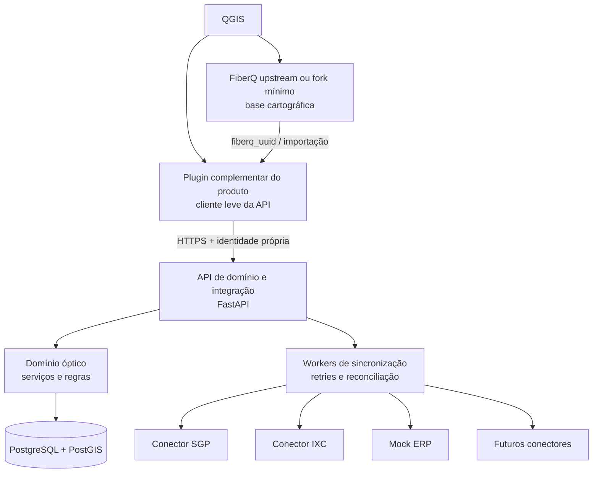
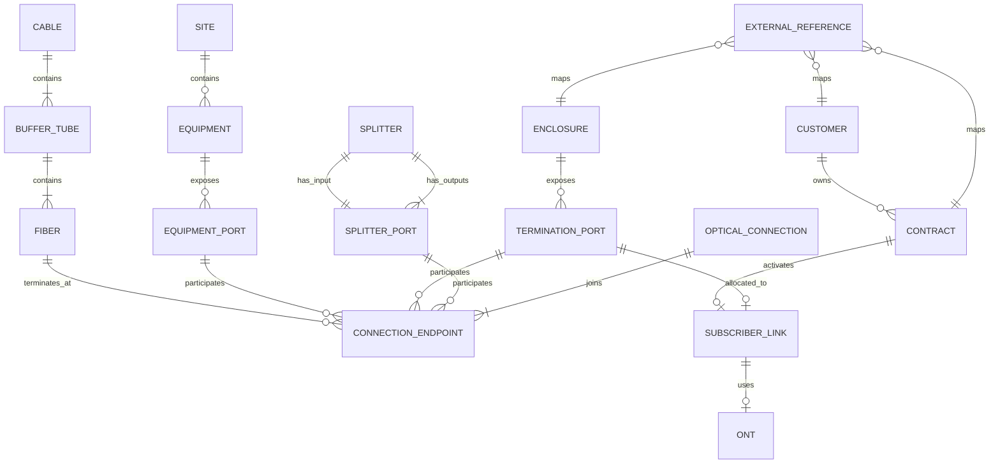

# Fase 0 — Avaliação inicial do FiberQ e proposta de fundação

Data da avaliação: 2026-08-31

Status: primeira entrega para revisão; nenhuma alteração foi feita no código do FiberQ.

## 1. Escopo e evidências da auditoria

O upstream foi clonado apenas para inspeção em um diretório temporário. A revisão tomou como referência:

- repositório oficial `vukovicvl/fiberq`;
- branch `main`;
- commit `409db64e78483c01f343f2dcc0a8b2b070f7aada`;
- plugin FiberQ `1.4.0`;
- schema de projeto `1.0`;
- tag mais recente observada: `v1.4.0`;
- licença declarada: `GPL-3.0-or-later`.

Foram examinados o README principal e o README do plugin, LICENSE, CONTRIBUTING, metadados, configuração, automação, CI, documentação de schema e validação, fonte canônica do modelo, migrações, gerenciadores centrais, addons e inventário de testes. Também foram consultadas as páginas oficiais do [plugin no QGIS](https://plugins.qgis.org/plugins/fiberq/), da [documentação FiberQ](https://www.fiberq.net/documentation/), da [API SGP](https://bookstack.sgp.net.br/books/api), da [API IXC](https://wikiapiprovedor.ixcsoft.com.br/) e do [token de integração IXC](https://wiki-erp.ixcsoft.com.br/documentacao/guias-tutoriais/api/como-gerar-um-token-para-integracoes-api).

## 2. Auditoria resumida do FiberQ

### Estrutura atual

O FiberQ é um plugin Python/PyQGIS organizado em módulos dentro de um único pacote instalável:

- `main_plugin.py`: composição e ciclo de vida do plugin;
- `core/`: criação e gestão de camadas, cabos, rotas, exportação, persistência, validação, migrações e undo;
- `tools/`: ferramentas de mapa;
- `dialogs/` e `ui/`: interface Qt;
- `models/schema.py`: fonte canônica do schema;
- `addons/`: publicação PostGIS, visualização, rompimento e corte de infraestrutura;
- `styles/`, `icons/`, `resources/` e `i18n/`: apresentação e localização.

O pacote não declara dependências Python externas em runtime e foi projetado para executar com os bindings fornecidos pelo QGIS. A versão 1.4.0 declara compatibilidade com QGIS 3.22 até 4.x, cobrindo Qt5 e Qt6.

### Persistência e identidade

- As camadas são criadas inicialmente em memória.
- GeoPackage é o principal formato de exportação/intercâmbio local.
- Há publicação direta de camadas em PostGIS, configurada no próprio plugin.
- Cada feição possui `fiberq_uuid`, introduzido no schema 1.0.
- A versão do schema é registrada no projeto QGIS e espelhada no GeoPackage.
- A única migração atual é `0 -> 1.0`, que adiciona e preenche `fiberq_uuid` de forma idempotente.
- Reservas e rompimentos referenciam cabos por `cable_layer_id + cable_fid`, não por uma chave estrangeira relacional persistida no banco.
- Algumas relações são armazenadas como JSON em propriedades do projeto QGIS.

### Modelo atual

O FiberQ representa geometrias e atributos de rotas, postes, caixas subterrâneas, cabos aéreos/subterrâneos, dutos, reservas, áreas, objetos, ODFs, caixas de terminação e caixas de emenda. O cabo registra contagens e padrão de cores, mas não existem entidades persistidas para:

- fibra individual;
- tubo e posição individual dentro do tubo;
- fusão/emenda entre fibras;
- porta de OLT/PON;
- porta de splitter e encadeamento de splitters;
- porta de CTO;
- continuidade óptica ponta a ponta;
- cliente, contrato, ONU/ONT e vínculo de serviço;
- referência externa genérica, cursor de sincronização ou conflito;
- auditoria de domínio antes/depois.

Assim, o modelo existente é uma boa base cartográfica e de inventário agregado, mas não atende sozinho ao domínio operacional e relacional exigido pelo MVP.

### Qualidade e testes

O upstream contém 27 arquivos de teste e 255 funções de teste identificadas estaticamente. Há cobertura para schema, migrações, UUID, validação, topologia, UI, estilos, relatórios, comprimentos e compatibilidade QGIS 4. A CI executa lint, Bandit e pytest em imagens QGIS 3.44 e 4.0.

Os testes não puderam ser executados nesta estação durante a auditoria: o Python local não possui `qgis` nem `pytest`. Isso não é falha comprovada do upstream; é uma lacuna do ambiente local que deverá ser eliminada por um ambiente containerizado reproduzível.

### Conclusão da auditoria

A direção recomendada é preservar o FiberQ como upstream cartográfico e construir a integração como componentes separados. O núcleo relacional FTTx e os conectores ERP não devem ser inseridos diretamente nos gerenciadores atuais do FiberQ. Um plugin complementar pode interoperar por UUID, API e camadas publicadas, enquanto o middleware mantém a autoridade transacional e multiusuário.

## 3. Riscos técnicos e de licença

| Risco | Nível | Tratamento proposto |
|---|---:|---|
| Schema atual agregado, sem fibra/fusão/porta individual | Alto | Criar domínio relacional próprio no PostGIS e adaptador de importação FiberQ. |
| Referências por ID de camada e FID podem mudar em exportações | Alto | Resolver uma vez e persistir relacionamentos novos somente por UUID interno estável. |
| Camadas com campos legados em sérvio, aliases em inglês e domínios inconsistentes | Alto | Não renomear in-place; criar mapeamento de ingestão versionado e migrations explícitas. |
| Escrita concorrente direta do QGIS no PostGIS | Alto | Concentrar regras, validações e writes críticos na API; usar transações e controle de versão. |
| Dependência simultânea de QGIS 3/Qt5 e QGIS 4/Qt6 | Médio | Matriz de CI e camada de compatibilidade; evitar APIs exclusivas de uma versão. |
| Plugin QGIS não aceita novas dependências runtime facilmente | Alto | Manter o cliente do plugin leve; FastAPI/Pydantic/SQLAlchemy ficam no middleware. |
| API SGP pública visível não documenta todo o contrato FTTx necessário | Alto | Solicitar Postman/documentação vigente e homologação; manter capacidades como desconhecidas. |
| Documentação IXC expõe categorias, mas contratos variam por versão/instalação | Alto | Validar paths, tabelas, headers, filtros e permissões no ambiente alvo. |
| Dados pessoais de clientes transitando pelo GIS | Alto | Minimização, RBAC, mascaramento, retenção e separação de dados cadastrais e infraestrutura. |
| Confusão de marca com FiberQ, SGP ou IXC | Médio | Nome próprio, avisos claros de derivação e ausência de afiliação oficial. |
| Obrigações GPL ao distribuir plugin derivado | Alto | Preservar notices, fornecer código-fonte correspondente, registrar modificações/datas e licenciar o derivado compatível como GPL-3.0-or-later. |
| Recursos “Pro” e chave de ativação presentes no código GPL | Médio | Não assumir incompatibilidade jurídica automática: GPL permite cobrança, mas destinatários mantêm liberdades GPL. Revisar comunicação, marcas e fronteira dos componentes com aconselhamento jurídico se houver distribuição comercial. |
| Chave mestra de ativação embutida no cliente upstream | Alto, segurança | Não reutilizar como mecanismo de segurança ou autorização. Autorização real ficará no servidor com identidade e RBAC. |

Esta seção é uma avaliação técnica de conformidade, não parecer jurídico.

## 4. Arquitetura proposta

### Fronteiras

- **FiberQ/fork mínimo:** desenho, edição cartográfica, compatibilidade com projetos existentes e exportação.
- **Plugin complementar:** visualização do domínio operacional, sugestões de CTO, conflitos e comandos autorizados; não armazena credenciais ERP.
- **API de domínio:** única porta para regras de ocupação, continuidade, orçamento óptico, auditoria e acesso multiusuário.
- **PostGIS:** fonte de verdade da infraestrutura e topologia óptica; GeoPackage permanece como intercâmbio/offline controlado.
- **Framework de conectores:** portas/adaptadores com capacidades declaradas por conector, sem condicionais SGP/IXC no domínio.
- **Workers:** sincronização incremental, idempotência, backoff, fila de erros e reconciliação.

### Decisão recomendada para aprovação

Adotar plugin complementar e middleware separados, mantendo modificações no fork do FiberQ no menor nível possível. Só alterar o fork quando não houver extensão pública/estável suficiente para interoperar. Essa decisão reduz conflitos com upstream, isola dependências e evita que contratos de ERP contaminem o plugin cartográfico.

## 5. Modelo de dados inicial

O modelo será dividido em cinco contextos:

1. **Infraestrutura física:** site/POP, estrutura, duto, microduto, cabo, tubo, fibra, reserva e caixa.
2. **Equipamentos e portas:** OLT, chassis, slot, porta PON, ODF/DIO, adaptador, splitter, CTO e portas.
3. **Conectividade:** término, fusão, conector e enlace, sempre entre pontos termináveis compatíveis.
4. **Serviço:** cliente espelhado, contrato espelhado, ONU/ONT e vínculo cliente-porta.
5. **Integração e governança:** referência externa, execução de sync, item de erro, conflito, auditoria e anexo.

### Invariantes iniciais

- Toda entidade usa UUID interno; `fiberq_uuid` é reutilizado quando a entidade deriva diretamente de uma feição FiberQ.
- `external_reference` possui unicidade por `(provider, entity_type, external_id)` e por `(provider, entity_type, internal_uuid)` quando a cardinalidade for 1:1.
- Uma fibra só pode ocupar uma posição em um tubo e um cabo.
- Uma porta física não pode ter duas ocupações ativas incompatíveis.
- Uma conexão óptica deve ter exatamente os endpoints exigidos pelo seu tipo.
- Uma saída de splitter não pode alimentar simultaneamente dois caminhos ativos sem elemento de derivação explícito.
- Exclusões operacionais serão lógicas; alterações relevantes terão auditoria antes/depois.
- Clientes e contratos importados não serão usados como fonte de verdade de infraestrutura.

O desenho lógico ainda precisa ser convertido em tabelas, constraints Postgres e migrations Alembic após aprovação.

## 6. Matriz inicial de capacidades SGP e IXC

Legenda: **confirmado** significa somente que a documentação oficial pública examinada demonstra a capacidade ou categoria; **desconhecido** significa que path, método ou semântica suficientes para implementação ainda não foram confirmados.

| Capacidade | SGP | IXC | Situação para implementação |
|---|---|---|---|
| Autenticação de integração | Token/App recomendado e Basic em endpoints compatíveis | Token vinculado a usuário com acesso API | Conceito confirmado; formato exato por endpoint/header ainda deve ser testado. |
| Usuário exclusivo e menor privilégio | Permissões do usuário e restrições de hosts/rotas no token | Usuário/grupo exclusivo, permissões e redes/IPs permitidos | Confirmado como requisito de segurança. |
| Base URL versionada | Não confirmada na documentação pública examinada | `https://SEU_DOMINIO/webservice/v1/` | Confirmada somente para IXC. |
| Listar clientes | Categoria/exemplo de consulta existe, contrato completo não obtido | Categoria “Clientes” existe | Endpoint, campos, paginação e incremental: desconhecidos. |
| Listar contratos | Existem operações e eventos relativos a contrato, contrato completo não obtido | Categoria “Contratos” existe | Endpoint, status e paginação: desconhecidos. |
| Coordenadas de instalação | Documentação de mapa confirma uso de coordenadas de endereço | Não confirmado no contrato de API examinado | Campos e origem: desconhecidos. |
| Listar CTO/caixa | Changelog público menciona consulta de uma CTO; documentação de mapa usa CTO | Categoria Inmap “Caixas de atendimento” existe | Paths, filtros, campos e versão: desconhecidos. |
| Portas de CTO | Uso de CTO e porta aparece no fluxo de mapa/serviço | Não confirmado na documentação examinada | Leitura e escrita: desconhecidas. |
| OLT/ONU | Fluxo SGP menciona ONU e módulo OLT | Categorias OLT e “Clientes Fibra (ONU)” existem | Contratos API e relacionamentos: desconhecidos. |
| Vincular cliente a CTO/porta | Fluxo funcional existe na UI/integração de mapa | Não confirmado | Endpoint oficial de escrita: desconhecido; capacidade desabilitada. |
| Webhooks/eventos | Gateway genérica envia eventos de serviço/contrato em cenário específico | Não confirmado | Não assumir como feed geral; garantias de entrega desconhecidas. |
| Paginação/incremental/ETag | Não confirmado | Não confirmado | Obrigatório obter documentação/fixtures de homologação. |
| Escrita segura e idempotente | Não confirmada | Não confirmada | Desabilitada até Fase 6 e validação formal. |

Nenhum endpoint de negócio foi codificado ou inferido nesta etapa.

## 7. Plano incremental e marcos verificáveis

### Marco D0 — Aprovação da descoberta

- Aprovar esta avaliação, a separação por plugin complementar e o modelo inicial.
- Definir o nome próprio do produto.
- Definir organização/repositório GitHub onde o fork será criado.

Critério: ADRs iniciais autorizados e nenhuma questão estrutural em aberto.

### Marco D1 — Evidência de APIs

- Obter documentação/Postman vigente do SGP.
- Registrar versão do IXC alvo e documentação correspondente.
- Obter respostas sanitizadas de homologação.
- Preencher matriz com path, método, autenticação, paginação, filtros e permissões.

Critério: cada capacidade do MVP está marcada como confirmada ou indisponível, com evidência.

### Marco F1 — Fundação reproduzível

- Criar fork com `origin` próprio e `upstream` oficial.
- Preservar LICENSE/notices e documentar proveniência.
- Criar Docker Compose para API/PostGIS, migrations e testes.
- Executar suite upstream em ambiente QGIS containerizado.

Critério: bootstrap documentado, CI verde e importação de exemplo FiberQ sem perda.

### Marco F2 — Domínio óptico mínimo

- Implementar entidades e constraints de OLT/PON, cabo/tubo/fibra, splitter/porta, CTO/porta e conectividade.
- Implementar rastreamento OLT → porta CTO e orçamento óptico básico.

Critério: testes de topologia, ocupação incompatível rejeitada e rastreamento determinístico.

### Marco F3 — Framework ERP e mock

- Definir interface de capacidades.
- Implementar mock, `dry-run`, idempotência, auditoria, retries, erros e reconciliação.

Critério: sincronização repetida do mock não duplica registros e falhas não deixam persistência parcial.

### Marcos F4/F5 — SGP e IXC somente leitura

- Implementar cada conector a partir dos contratos confirmados.
- Importar clientes/contratos/coordenadas disponíveis e relatar divergências.

Critério: testes de contrato com fixtures sanitizadas e writes globalmente desabilitados.

### Marco F6 — Escrita controlada

- Escolher uma operação de baixo risco em homologação.
- Exigir feature flag, `dry-run`, confirmação e auditoria.
- Avaliar vínculo cliente/CTO/porta somente após evidência específica.

Critério: operação reversível ou compensável, validada em homologação, sem habilitação global por padrão.

## 8. Questões que exigem decisão ou insumo

- Nome do produto derivado.
- Organização e conta GitHub onde o fork deverá residir.
- Instalações/versões alvo de QGIS para o primeiro piloto.
- Versões e ambientes de homologação SGP e IXC.
- Documentação/Postman e payloads sanitizados dos ERPs.
- Regra de autoridade para o vínculo cliente/CTO/porta quando GIS e ERP divergirem.

## 9. Plataforma de implantação

A compatibilidade com Ubuntu Server 26.04 LTS foi avaliada e considerada viável para API, workers, PostgreSQL/PostGIS, backups e testes PyQGIS headless. O QGIS Desktop e os plugins interativos permanecem nas estações dos usuários. A arquitetura inicial certificada será `amd64`, containerizada e testada em Ubuntu 26.04; versões futuras do Ubuntu exigirão recertificação em vez de compatibilidade presumida.

Detalhes e critérios de aceite: [`ubuntu-26.04-compatibility.md`](ubuntu-26.04-compatibility.md).
