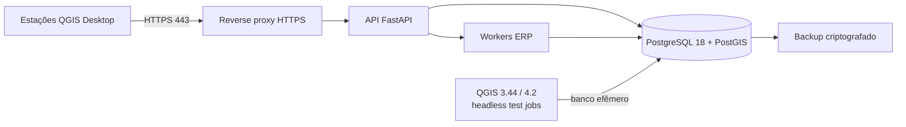

# Compatibilidade com Ubuntu Server 26.04 LTS

Data da avaliação: 2026-08-31

## Conclusão

É tecnicamente viável instalar e operar a camada servidor do produto em Ubuntu Server 26.04 LTS. Essa versão deve ser a primeira plataforma Linux certificada do projeto.

A arquitetura deve distinguir dois ambientes:

- **Servidor Ubuntu:** API FastAPI, workers de sincronização, PostgreSQL/PostGIS, migrations, proxy TLS, observabilidade, backups e testes headless do plugin.
- **Estações dos usuários:** QGIS Desktop e os plugins FiberQ/complementar, com interface gráfica.

O plugin QGIS interativo não será executado como aplicação de usuário no Ubuntu Server sem desktop. Os testes PyQGIS poderão rodar no servidor com `QT_QPA_PLATFORM=offscreen`, dentro de imagens oficiais QGIS. QGIS Server é um produto distinto e não é requisito do MVP; sua eventual adoção para WMS/WFS será tratada separadamente.

## Evidências de compatibilidade

- Ubuntu 26.04 LTS, codinome Resolute Raccoon, foi lançado em 2026-04-23, tem suporte padrão até 2031 e já possui point release 26.04.1.
- A distribuição inclui Docker 29 e oferece `docker.io` e Docker Compose v2 em seus repositórios.
- O Ubuntu 26.04 fornece PostgreSQL 18 e PostGIS 3.6.x; o repositório oficial PGDG também suporta o codinome `resolute`.
- O repositório oficial do QGIS lista Ubuntu 26.04 `resolute` como distribuição suportada, a partir de QGIS 4.0.1/3.44.9.
- As imagens oficiais `qgis/qgis` oferecem versões QGIS 3.44 LTR e 4.2, adequadas para reproduzir a matriz Qt5/Qt6 do upstream FiberQ.
- As tags oficiais QGIS examinadas são publicadas para `linux/amd64`. Por isso, `amd64/x86_64` será a arquitetura inicial certificada para o servidor de testes. ARM64 somente será declarado suportado depois de uma matriz PyQGIS própria ou de imagens equivalentes verificadas.

Referências oficiais:

- [Lista e ciclo de suporte do Ubuntu](https://ubuntu.com/project/docs/release-team/list-of-releases/)
- [Notas de versão do Ubuntu 26.04](https://documentation.ubuntu.com/release-notes/26.04/)
- [Guia oficial de instalação do QGIS](https://qgis.org/resources/installation-guide/)
- [Imagem Docker oficial do QGIS](https://hub.docker.com/r/qgis/qgis)
- [Pacote PostgreSQL 18 do Ubuntu](https://packages.ubuntu.com/resolute/postgresql-18)
- [Pacote PostGIS para PostgreSQL 18](https://packages.ubuntu.com/resolute/postgresql-18-postgis-3)
- [Repositório PostgreSQL para Ubuntu](https://www.postgresql.org/download/linux/ubuntu/)
- [Docker Compose v2 no Ubuntu 26.04](https://packages.ubuntu.com/source/resolute/docker-compose-v2)

## Topologia recomendada

### Serviços do Docker Compose

| Serviço | Papel | Exposição recomendada |
|---|---|---|
| `api` | API de domínio e integração | Somente rede interna; publicada via proxy. |
| `worker` | Sincronização, retries e reconciliação | Sem porta pública. |
| `db` | PostgreSQL/PostGIS | Sem porta pública em produção. |
| `proxy` | TLS, limites e encaminhamento | Porta 443; porta 80 apenas para redirect/challenge. |
| `migration` | Alembic em job de implantação | Execução pontual, sem porta. |
| `qgis-test-3` | Testes QGIS 3.44/Qt5 | Perfil de CI/teste, não iniciado em produção. |
| `qgis-test-4` | Testes QGIS 4.2/Qt6 | Perfil de CI/teste, não iniciado em produção. |

O banco poderá ser executado em container no desenvolvimento/homologação. Para produção, container ou instalação nativa são possíveis; a decisão dependerá da operação de backups, monitoramento e política de atualização. O contrato SQL/PostGIS será o mesmo.

## Política de versões

Não é seguro interpretar “26.04 para cima” como compatibilidade automática com toda versão futura do Ubuntu. A política proposta é:

- Ubuntu Server 26.04 LTS `amd64`: plataforma inicial obrigatória e certificada.
- Point releases 26.04.x: suportados após atualização automatizada e smoke test.
- Próximas versões LTS: candidatas a suporte após execução da mesma matriz de CI, migration, backup e restauração.
- Versões intermediárias do Ubuntu: permitidas para desenvolvimento, mas não certificadas para produção por padrão.
- Imagens de aplicação, banco e QGIS: versões fixadas por tag imutável/digest e atualizadas por processo controlado.

Essa política evita que uma alteração no Python, Qt, GDAL, PROJ, Docker ou PostgreSQL do host quebre silenciosamente o produto.

## Compatibilidade por componente

| Componente | Ubuntu Server 26.04 | Estratégia |
|---|---|---|
| FastAPI/Pydantic/SQLAlchemy/Alembic | Compatível | Container Python com versão fixada; não depender do Python do host. |
| PostgreSQL/PostGIS | Compatível | PostgreSQL 18 + PostGIS 3.6 inicialmente; extensões e migrations testadas. |
| Docker Compose | Compatível | `docker.io` + `docker-compose-v2` do Ubuntu ou mecanismo equivalente aprovado. |
| Plugin QGIS gráfico | Não é serviço headless | Instalar nas estações QGIS Desktop. |
| Testes PyQGIS | Compatível | Imagens oficiais QGIS com `QT_QPA_PLATFORM=offscreen`. |
| GeoPackage/OGR/GDAL | Compatível | Validar importação/exportação em ambas as imagens QGIS. |
| Conectores SGP/IXC | Compatível | HTTPS a partir dos workers; egress restrito e secrets fora das imagens. |
| QGIS Server | Opcional | Fora do MVP; avaliar somente se houver requisito WMS/WFS/web map. |

## Riscos específicos do Ubuntu 26.04

### Docker 29 e firewall

O Ubuntu 26.04 atualizou o Docker para a série 29 e menciona backend `nftables` experimental. Regras de Docker, UFW e nftables precisam ser testadas juntas. O banco não deve ser publicado em `0.0.0.0`; em produção, somente 443 deve ser acessível externamente, salvo acesso administrativo restrito.

### Python do host

As aplicações não devem instalar dependências diretamente no Python do sistema. Containers e lockfiles evitam conflitos com a versão fornecida pelo Ubuntu e tornam o ambiente repetível.

### Arquitetura ARM

PostgreSQL/PostGIS possuem pacotes ARM64, mas as imagens QGIS oficiais observadas estão em `linux/amd64`. O primeiro ambiente de homologação deve usar servidor x86_64. Uma instalação ARM não será bloqueada conceitualmente, porém não será certificada até os testes QGIS estarem cobertos.

### Atualizações de componentes GIS

GDAL, GEOS, PROJ e QGIS podem alterar comportamento geométrico ou serialização. O projeto deve manter fixtures GeoPackage, hashes lógicos e testes de ida/volta, sem depender apenas de “o container iniciou”.

## Dimensionamento inicial para homologação

Estimativa inicial, a ser calibrada com volume real:

- arquitetura: `amd64/x86_64`;
- CPU: 4 vCPU;
- memória: 8 GB RAM;
- armazenamento: 80 GB SSD, com volume de banco separado quando possível;
- swap: 2–4 GB apenas como proteção, não como substituto de RAM;
- rede: HTTPS de saída para SGP/IXC e entrada 443 para a API;
- backup: destino externo ao host e teste de restauração.

Para produção multiusuário ou testes QGIS paralelos, o ponto inicial recomendado é 8 vCPU e 16 GB RAM. Esses valores são premissas de engenharia, não mínimos oficiais.

## Plano de certificação no Ubuntu 26.04

1. Instalar Ubuntu Server 26.04.1 LTS `amd64` e aplicar todas as atualizações.
2. Instalar Docker/Compose a partir de uma origem escolhida e fixar suas versões no inventário.
3. Subir um Compose mínimo com API, worker e PostgreSQL/PostGIS.
4. Confirmar `CREATE EXTENSION postgis`, healthchecks e persistência após restart.
5. Executar migrations Alembic para frente e rollback em banco descartável.
6. Executar testes unitários da API e domínio.
7. Executar os 255 testes upstream identificados nas imagens QGIS 3.44 e QGIS 4.2.
8. Importar o GeoPackage de exemplo FiberQ, publicar no PostGIS e comparar entidades/UUIDs.
9. Testar restart forçado do banco/worker e comprovar ausência de duplicidade/corrupção.
10. Gerar backup, destruir o banco de teste, restaurar e executar validação de integridade.
11. Executar varredura de portas, teste TLS e conferência de logs sem segredos/dados pessoais.

## Critérios de aceite da plataforma

- `docker compose up` reproduz o ambiente em Ubuntu 26.04 limpo.
- Todos os containers possuem healthcheck e política de restart adequada.
- API e worker não dependem de pacotes Python instalados no host.
- PostGIS inicializa e migrations são reversíveis em banco de teste.
- Suítes QGIS 3 e 4 passam em modo headless.
- GeoPackage FiberQ mantém `fiberq_uuid` após ida e volta.
- Banco não é exposto publicamente.
- Backup e restauração são comprovados, não apenas configurados.
- Atualização de point release do Ubuntu passa por smoke test antes de produção.

## Decisão recomendada

Registrar Ubuntu Server 26.04 LTS `amd64` como sistema operacional de referência da fundação e do ambiente de homologação. Adotar containers como fronteira de compatibilidade e certificar futuras versões Ubuntu por matriz de testes, sem prometer compatibilidade automática.
